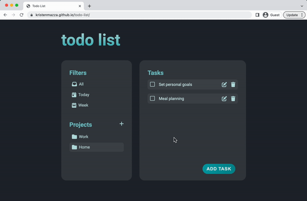

# Todo List

Organize and keep track of tasks:

- Save todo items in custom folders
- View, edit, delete, and check off todo items
- Filter todo items by week or current day
- Local storage stores project and task information

# Built Using

- JavaScript
- CSS
- Date-fns library
- Local storage
- Webpack

[Live Demo](https://kristenmazza.github.io/todo-list/) :point_left:

# Set Up Instructions

1. Install dependencies (`npm install`)
2. Generate assets (`npm run build`)
3. Run server (`npm start`)
